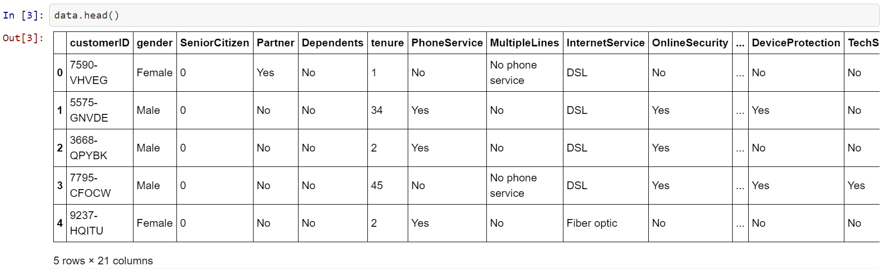
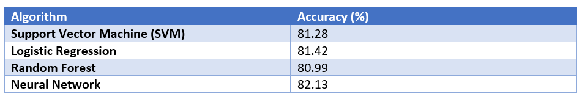

# Predicting-Telco-Churn
A binary classification project utilizing SVMs, logistic regression, random forest, and feed-forward neural networks to predict Telco customer churn. 

The data included 7043 observations and 21 variables including the target variable, churn. The following shows a portion of the dataset:

The following table shows the test accuracies achieved by the four methods:

aaaa
cccc
